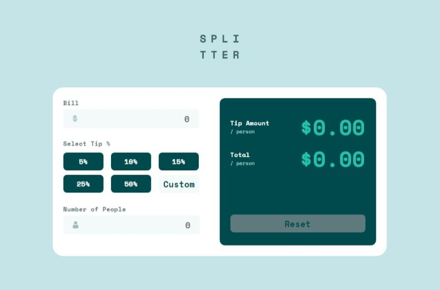
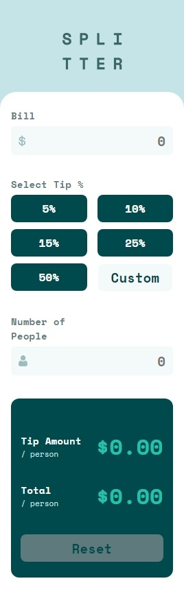

# Tip Calculator App

## Overview
This is a simple application that calculates the tip for a given amount. It's built using HTML, CSS, and JavaScript.

Here is the desktop and mobile view:

    
    

## Features
- Input the bill amount
- Select the tip percentage
- Calculate the tip and total bill per person
- Handle multiple people splitting the bill

## Technologies Used
- HTML 5
- CSS
- Vanilla JS

## How to Use
1. Enter the total bill amount.
2. Select the tip percentage you want to give.
3. If more than one person is splitting the bill, enter the number of people.
4. Click on the 'Calculate' button to get the tip amount and total amount per person.

## Contributing
I know my code is lacking most of the features. So pull requests are welcome for the major and minor changes.
